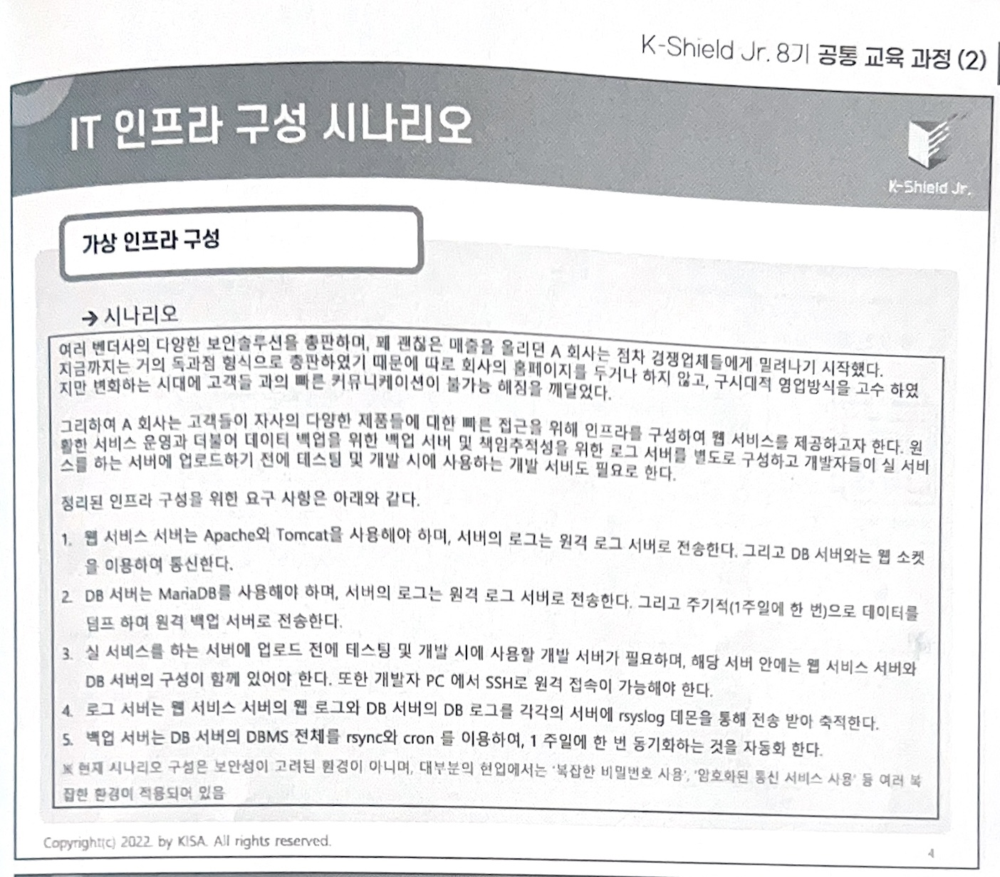

# Infra Composition

## VM 환경에서 인프라 구성
k-Shied Jr에서 배운 인프라 구성을 바탕으로 VM 환경에서 [쇼핑몰 프로젝트](https://github.com/wlsdud0/java-spring-project-v2)의 인프라를 구축했다.

### 구축 환경
- VMware Fusion
- Ubuntu 24.04
- MariaDB
- Spring Boot 3.0.2

## 구축 과정
### 공통
- [고정 IP 설정](./인프라-구성/0.%20(공통)고정IP설정.md)
### 개발 서버
- [apache2](./인프라-구성/1.%20dev_server/1.%20apache2.md)
- [was](./인프라-구성/1.%20dev_server/2.%20was.md)
- [vsftp](./인프라-구성/1.%20dev_server/3.%20vsftp.md)
- [mariaDB](./인프라-구성/1.%20dev_server/4.%20mariaDB.md)
- [spring boot + mariaDB](./인프라-구성/1.%20dev_server/5.%20spring%20boot%20+%20mariaDB.md)
- [프로젝트 실행](./인프라-구성/1.%20dev_server/6.%20프로젝트%20실행.md)
### DB 서버
- [mariaDB](./인프라-구성/2.%20db_server/1.%20mariaDB.md)
- [rsyslog](./인프라-구성/2.%20db_server/2.%20rsyslog%20설정.md)
### web-was 서버
- [apache2](./인프라-구성/3.%20web_was/1.%20apache2.md)
- [was](./인프라-구성/3.%20web_was/2.%20was.md)
- [vsftp](./인프라-구성/3.%20web_was/3.%20vsftp.md)
### 로그 서버
- [log_server](./인프라-구성/4.%20log_server/1.%20log_server.md)
### DB 백업 서버
- [db_backup_server](./인프라-구성/5.%20db_backup_server/1.%20db_backup_server.md)

## 인프라 구성 및 요구사항
1. 웹 서비스 서버 
   - 외부에서 웹 페이지 접속 시 서비스 제공 서버
   - 웹(Apache) 및 WAS(Tomcat)로 구성된 서버
   - DB 서버와는 웹 소켓 연결
2. DB 서버
   - 해당 웹 서비스의 회원 정보를 저장하는 서버
   - MariaDB 서비스 구성
3. 개발 서버
   - 웹 서비스 서버에 소스 코드를 업로드 하기 전 테스팅 및 개발 시 사용하는 서버
   - 웹 서비스 서버로 FTP로 통신 구간 연결
   - 개발자 PC(호스트)와는 SSH 터미널 연결
4. 로그 서버
   - 웹 서비스, DB 서버의 로그 저장
   - 주기적으로 웹 서비스 서버 및 DB서버에서 로그 전송
5. 백업 서버
   - DB 서버의 데이터를 덤프하여 저장

## Web Page
### dev_server

### web_was

## 시나리오

## 구성도

## 실습 시 전제 조건

