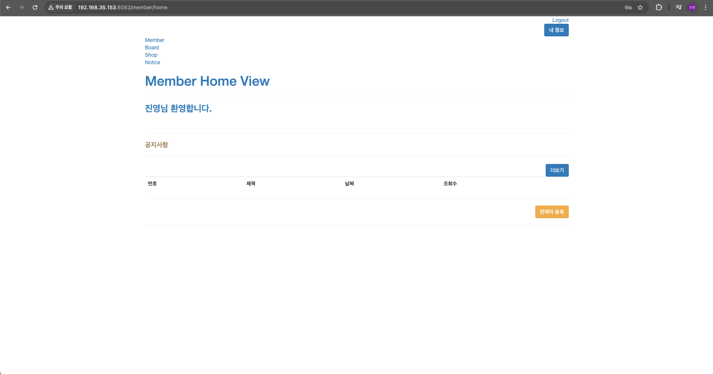

### git

```bash
# 설치
sudo apt inastall git

# 설정
git config --global user.name jinyoung
git config --global user.mail gjwlsdud730@gmail.com

# clone
git clone [url]
git clone https://github.com/wlsdud0/infra-composition.git
```

### Jar 파일 실행

```bash
cd ./infra-composition/게시판,회원관리,공지사항,쇼핑몰/board

sudo chmod 755 gradlew

./gradlew bootJar

java -jar build/libs/board-0.0.1-SNAPSHOT.jar
```

### Jar 파일 백그라운드 실행

```bash
nohup java -jar build/libs/board-0.0.1-SNAPSHOT > out.log &
```

