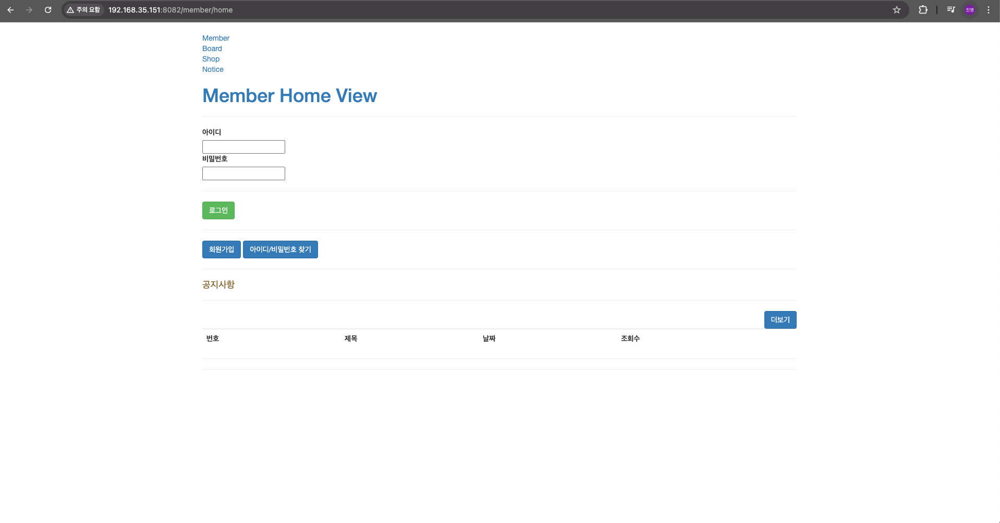

### apache2 설치

```bash
sudo apt install -y apache2 libapache2-mod-jk
```

### apache2 설정

```bash
# 기존 파일 수정
sudo vi /etc/apache2/sites-available/000-default.conf

# 추가
= DocumentRoot /var/www/html
   JkMount /* tomcat         # 추가 작성, apache2 + tomcat 연동하기 위함
```

```bash
# 파일 생성
sudo vi /etc/apache2/workers.properties

# 작성
	worker.list=tomcat
	workers.tomcat_home=/usr/share/tomcat9
	workers.java_home=/usr/lib/jvm/java-17-openjdk-arm64
	worker.tomcat.port=8009
	worker.tomcat.host=localhost
	worker.tomcat.type=ajp13
	worker.tomcat.lbfactor=1
```

```bash
# 기존 파일 수정
sudo vi /etc/apache2/mods-available/jk.conf

# 기존
JkWorkersFile /etc/libapache2-mod-jk/workers.properties
# 수정
JkWorkersFile /etc/apache2/workers.properties

```

```bash
# 아파치 재실행
sudo systemctl restart apache2
```

