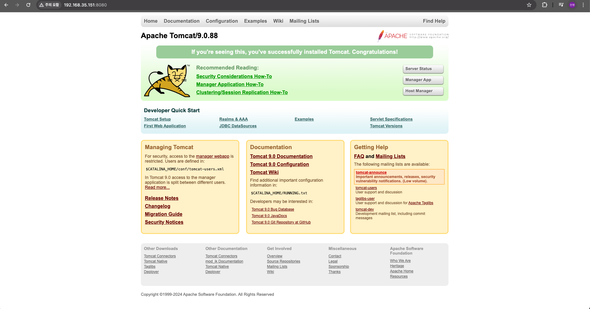

```bash
# 자바 설치
sudo apt install openjdk-17-jdk

# 자바 환경설정
sudo vi /etc/profile

# 추가
export JAVA_HOME=/usr/lib/jvm/java-17-openjdk-arm64 # 본인의 Java 설치경로
export PATH=$JAVA_HOME/bin:$PATH
export CLASSPATH=$CLASSPATH:$JAVA_HOME/lib/ext:$JAVA_HOME/lib/tools.jar

# 쉘에 적용
source /etc/profile

# 설정 확인
echo $JAVA_HOME
```


### tomcat9 설치

```bash
sudo apt install tomcat9 # 난 설치가 안되는 에러가 발생

# wget으로 설치
sudo wget https://dlcdn.apache.org/tomcat/tomcat-9/v9.0.88/bin/apache-tomcat-9.0.88.tar.gz

# 압축해제
sudo tar xvf apache-tomcat-9.0.88.tar.gz

# 폴더 이동
sudo mv apache-tomcat-9.0.88 /usr/local/tomcat9

# 톰캣 환경설정
sudo vi /etc/profile

# 추가
export CATALINA_HOME=/usr/local/tomcat9

# 쉘에 적용
source /etc/profile

# 설정 확인
echo $CATALINA_HOME

# /usr/local/[폴더명]/conf
# conf 권한 없다면
sudo chmod 755 conf

vi server.xml

# 추가
 <Connector port="8080" protocol="HTTP/1.1"
               URLEncoding="UTF-8"           # 추가 작성
               connectionTimeout="20000"
               redirectPort="8443"
               maxParameterCount="1000"
               />
```

### tomcat9 실행

```bash
# /usr/local/[폴더명]/bin
# 권한 없다면
sudo chmod 755 bin

# 실행
sudo ./startup.sh
```

